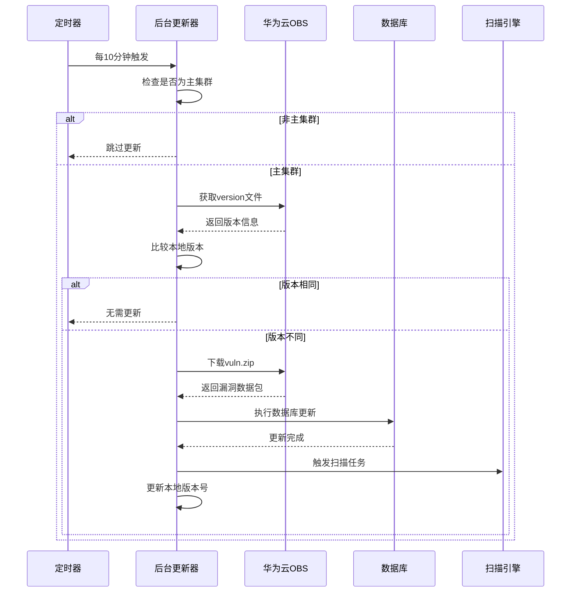

# 漏洞库在线自动更新系统设计方案

## 背景

当前的漏洞数据库更新模式存在以下问题和限制：

1. **手动更新效率低**：现有漏洞库更新依赖手动操作，无法及时响应最新漏洞信息
2. **时效性不足**：漏洞数据库的更新频率无法满足安全扫描的实时性要求
3. **运维成本高**：需要人工干预进行漏洞库版本管理和分发
4. **集群一致性**：多集群环境下漏洞库版本不一致，影响扫描结果的准确性

为了解决上述问题，需要实现一套自动化的漏洞库在线更新系统，确保漏洞数据库能够及时、自动地获取最新的漏洞信息，提升安全扫描的准确性和时效性。

## 需求分析

### 5W分析

- **Who**：安全扫描系统的开发者、运维人员、安全分析师
- **When**：7×24小时自动运行，每10分钟检查一次更新
- **What**：实现漏洞数据库的自动在线更新功能
- **Where**：部署在Kubernetes集群中，仅主集群执行更新逻辑
- **Why**：提升漏洞检测的时效性和准确性，降低运维成本

### 1H分析

**How**：通过华为云OBS存储漏洞数据库，后台定时检查版本差异，自动下载和更新本地漏洞库。

### 8C约束分析

- **性能 Performance**：单次更新时间不超过5分钟，不影响正在进行的扫描任务
- **成本 Cost**：使用华为云OBS存储，成本可控
- **时间 Time**：每10分钟检查一次，确保及时性
- **可靠性 Reliability**：包含错误重试机制，失败后等待下次循环
- **安全性 Security**：使用AK/SK方式认证，确保数据传输安全
- **合规性 Compliance**：符合企业数据安全规范
- **技术性 Technology**：基于Go语言和华为云OBS SDK
- **兼容性 Compatibility**：兼容现有的Trivy漏洞扫描引擎

### 其他考虑

- **高可用性**：仅主集群执行更新，避免重复操作
- **高性能**：异步执行，不阻塞主要业务流程
- **水平扩展**：支持多集群部署，自动选举主集群

## 解决方案

### 方案1：基于华为云OBS的自动更新方案

#### 架构图

```
┌─────────────────┐    ┌─────────────────┐    ┌─────────────────┐
│   华为云OBS     │    │   Scanner集群   │    │   漏洞扫描引擎   │
│                 │    │                 │    │                 │
│  ┌───────────┐  │    │  ┌───────────┐  │    │  ┌───────────┐  │
│  │  version  │  │◄───┤  │Background │  │    │  │   Trivy   │  │
│  │   文件    │  │    │  │ Updater   │  │────┤  │  Engine   │  │
│  └───────────┘  │    │  └───────────┘  │    │  └───────────┘  │
│                 │    │        │        │    │                 │
│  ┌───────────┐  │    │  ┌───────────┐  │    │  ┌───────────┐  │
│  │ vuln.zip  │  │◄───┤  │    DB     │  │    │  │   MySQL   │  │
│  │   文件    │  │    │  │ Updater   │  │────┤  │ Database  │  │
│  └───────────┘  │    │  └───────────┘  │    │  └───────────┘  │
└─────────────────┘    └─────────────────┘    └─────────────────┘
```

#### 模块设计

##### 模块1：OBS客户端模块

**功能点**：
- 负责与华为云OBS服务的交互
- 实现版本文件和漏洞数据包的下载
- 提供统一的配置管理和错误处理

**核心接口**：
```go
type ObsApi interface {
    GetObjectContent(ctx context.Context, key string) ([]byte, error)
}
```

**配置项**：
- `huawei-secret-id`：华为云访问密钥ID
- `huawei-secret-key`：华为云访问密钥Secret
- `huawei-endpoint`：华为云OBS服务端点
- `huawei-vuln-bucket`：漏洞数据库存储桶名称
- `vuln-version-key`：版本文件对象键（默认：version）
- `vuln-zip-key`：漏洞数据包对象键（默认：vuln.zip）

##### 模块2：后台更新器模块

**功能点**：
- 定时检查漏洞库版本更新
- 执行版本比较和更新决策
- 协调整个更新流程

**核心流程**：
1. 每10分钟触发一次检查
2. 从OBS获取远程版本信息
3. 与本地版本进行比较
4. 决定是否需要更新
5. 触发更新流程

**高可用设计**：
- 仅在主集群中运行，避免重复更新
- 包含panic恢复机制
- 失败重试策略

##### 模块3：数据库更新模块

**功能点**：
- 处理漏洞数据包的解压和安装
- 更新数据库元数据
- 触发相关扫描任务

**数据流转**：
```
OBS漏洞数据包 → 内存数据 → UpdateDbParam → 数据库更新 → 扫描任务触发
```

### 流程图



### 部署图

```
┌─────────────────────────────────────────────────────────────┐
│                    Kubernetes集群                            │
│                                                             │
│  ┌─────────────────┐  ┌─────────────────┐  ┌─────────────────┐│
│  │   Scanner Pod   │  │   Scanner Pod   │  │   Scanner Pod   ││
│  │    (主集群)     │  │   (副集群1)     │  │   (副集群2)     ││
│  │                 │  │                 │  │                 ││
│  │ ┌─────────────┐ │  │ ┌─────────────┐ │  │ ┌─────────────┐ ││
│  │ │Background   │ │  │ │Background   │ │  │ │Background   │ ││
│  │ │Updater      │ │  │ │Updater      │ │  │ │Updater      │ ││
│  │ │(Active)     │ │  │ │(Inactive)   │ │  │ │(Inactive)   │ ││
│  │ └─────────────┘ │  │ └─────────────┘ │  │ └─────────────┘ ││
│  └─────────────────┘  └─────────────────┘  └─────────────────┘│
│           │                                                   │
│           └─────────────────────┐                            │
└─────────────────────────────────┼────────────────────────────┘
                                  │
                     ┌─────────────────┐
                     │   华为云OBS     │
                     │                 │
                     │  ┌───────────┐  │
                     │  │  version  │  │
                     │  └───────────┘  │
                     │  ┌───────────┐  │
                     │  │ vuln.zip  │  │
                     │  └───────────┘  │
                     └─────────────────┘
```

## 关键数据结构设计

### 版本信息结构

```go
// 远程版本信息结构
type RemoteVersion struct {
    TrivyVersion struct {
        Version string `json:"version"` // 版本号
        Comment string `json:"comment"` // 版本说明
        Hash    string `json:"hash"`    // 版本哈希值
    } `json:"trivyVersion"`
}

// 数据库更新参数
type UpdateDbParam struct {
    Updater      string // 更新者标识
    DbType       string // 数据库类型（trivy）
    Data         []byte // 漏洞数据包内容
    CheckVersion bool   // 是否检查版本
    Path         string // 文件路径
}

// 扫描数据库配置
type ScanConfigDB struct {
    ID        int64  `gorm:"primaryKey" json:"id"`
    UniqueID  uint64 `gorm:"column:unique_id" json:"uniqueID,string"`
    DBVersion string `gorm:"db_version" json:"dbVersion"`
    DBType    string `gorm:"column:db_type" json:"dBType"`
    DBMd5     string `gorm:"column:db_md5" json:"dBMd5"`
    MetaJson  string `gorm:"column:meta" json:"-"`
    DBMeta    DBMeta `gorm:"-" json:"dBMeta"`
    Updater   string `gorm:"column:updater" json:"updater"`
    CreatedAt int64  `gorm:"autoCreateTime:milli;column:created_at" json:"createdAt"`
    UpdatedAt int64  `gorm:"autoUpdateTime:milli;column:updated_at" json:"updatedAt"`
}
```

### 配置参数结构

```go
// Scanner配置选项
type ScannerOpts struct {
    HuaweiSecretId   string // 华为云访问密钥ID
    HuaweiSecretKey  string // 华为云访问密钥Secret
    HuaweiEndpoint   string // 华为云OBS端点
    HuaweiVulnBucket string // 漏洞数据库存储桶
    VulnVersionKey   string // 版本文件对象键
    VulnZipKey       string // 漏洞数据包对象键
}
```

## 实施计划

### 阶段1：基础功能实现（已完成）
- [x] OBS客户端封装
- [x] 版本比较逻辑
- [x] 后台定时更新器
- [x] 数据库更新接口

### 阶段2：优化和完善
- [ ] 添加更详细的错误处理和日志
- [ ] 实现更新进度监控
- [ ] 添加手动触发更新接口
- [ ] 完善配置验证机制

### 阶段3：监控和运维
- [ ] 添加Prometheus监控指标
- [ ] 实现更新状态API
- [ ] 添加更新历史查询功能
- [ ] 完善告警机制

## 关键技术要点

### 版本比较策略
使用字符串版本号直接比较，当远程版本与本地版本不同时触发更新。

### 并发控制
通过主集群选举确保只有一个实例执行更新操作，避免重复下载和更新。

### 错误处理
采用"fail-fast"策略，单次失败不影响整体系统，等待下次定时检查重试。

### 数据一致性
更新过程中保持数据库事务性，确保更新成功后才更新版本号。

## 监控和运维

### 关键指标
- 更新检查频率：每10分钟
- 更新成功率：>95%
- 单次更新时长：<5分钟
- 版本延迟：<30分钟

### 日志记录
- 版本检查日志
- 下载进度日志
- 更新结果日志
- 错误详情日志

### 告警规则
- 连续3次更新失败
- 版本延迟超过1小时
- OBS连接异常

## 附录

### 参考资料
- [华为云OBS Go SDK文档](https://support.huaweicloud.com/sdk-go-devg-obs/zh-cn_topic_0132887211.html)
- [Trivy漏洞数据库格式说明](https://aquasecurity.github.io/trivy/latest/docs/vulnerability/db/)

### 配置示例
```yaml
# Scanner配置示例
huawei-secret-id: "your-access-key-id"
huawei-secret-key: "your-access-key-secret"
huawei-endpoint: "obs.cn-southwest-2.myhuaweicloud.com"
huawei-vuln-bucket: "tensor-vuln-db"
vuln-version-key: "version"
vuln-zip-key: "vuln.zip"
```

### 部署清单
```bash
# 启动Scanner服务时添加华为云OBS配置
./scanner \
  --huawei-secret-id="your-access-key-id" \
  --huawei-secret-key="your-access-key-secret" \
  --huawei-endpoint="obs.cn-southwest-2.myhuaweicloud.com" \
  --huawei-vuln-bucket="tensor-vuln-db" \
  --vuln-version-key="version" \
  --vuln-zip-key="vuln.zip"
```
