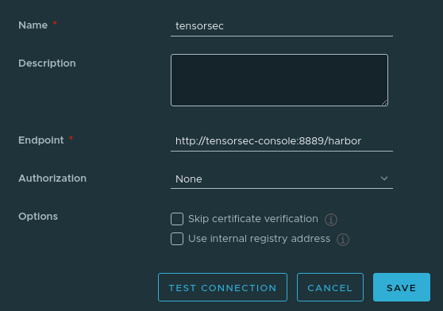

## Harbor integration


## Deploy Harbor in your dev environment

```bash
helm repo add harbor https://helm.goharbor.io

# Note: Harbor helm has strict deployment exposing requirements. Without meeting them, login screen doesn't work.
# For example: https://github.com/goharbor/harbor-helm/issues/75
# Therefore, we will use expose.type=nodePort. 

# !!!!!!!!!! This requires setting up port forwarding in Virtualbox! !!!!!!!
helm install --name my-harbor --set expose.type=nodePort --set expose.tls.auto.commonName=someName --set persistence.resourcePolicy=dontkeep harbor/harbor

k8 describe svc harbor | grep NodePort
# Type:                     NodePort
# NodePort:                 http  30002/TCP
# NodePort:                 https  30003/TCP
# NodePort:                 notary  30004/TCP

# Go to Virtualbox -> Any of your VM node settings -> Network -> Advanced -> Port forwarding -> 30003 to 30003 in above case
# Then go to https://localhost:30003, ignore the certificate warning, and you should be able to login

# Default creds are: admin/Harbor12345

# To cleanup:
# helm delete --purge my-harbor
```

## Add Tensorsec plugin in Harbor

1. Go to Administration -> Interrogation services -> New scanner
2. Enter fields as follows



notice, that Endpoint address is the address of Tensorsec Console, with /harbor sub-path.

3. Test Connection -> Save
4. Select Tensorsec -> Set as default

## Manual testing

How to add images from a local docker registry and scan them:

1. Go to Administration -> Registries -> New Endpoint and add your local docker registry (must provide external IP address, e.g. http://192.168.1.203:5000)
2. Go to Replications -> New -> Pull based -> Provide source registry and MUST provide some arbitrary name for namespace.
3. Repliaction -> Select your rule -> Replicate
4. You can see logs by clicking on your replication rule -> click on "ID" number under executions table.
5. Go to Projects -> your namespace -> one of images -> select it -> scan.
